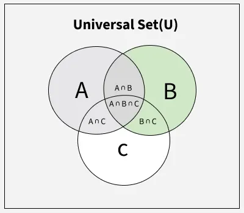

# Grundbegriffe der Wahrscheinlichkeitsrechnung

- Zufallsvorgang: Wiederholbares und zufälliges Ereigniss
- Zufallsexperimente: Durchgeführter Zufallsvorgang
- Ergebnismenge: Alle möglichen Ergebnisse, die ein Ereignis annehmen kann
  - Bei einem Würfel wäre das: E = {1, 2, 3, 4, 5, 6}
- Ereignis: Ein einzelnes Ereignis in der Ereignismenge
- Satz von Bayes: Verknüpft die bedingte Wahrscheinlichkeit $P(A|B)$ mit der umgekehrten bedingten Wahrscheinlichkeit $P(B|A)$ und den unbedingten Wahrscheinlichkeiten $P(A)$ und $P(B)$
- LaPlace: p = Anzahl der möglichen Ereignisse / die Anzahl aller Ereignisse
  - Das gilt, wenn alle Ergebnisse gleich wahrscheinlich sind
  - Bei einem Würfel wäre die Wahrscheinlichkeit, dass eine 2 gewürfelt wird: p = 1 / 6
  - Die Wahrscheinlichkeit, dass eine 1 oder eine 4 gewürfelt ist: p = 2 / 6 = 1 / 3
- $A \cap B$: Der Schnitt. Enthält alle Ergebnisse, die in beiden Ereignissen liegen
- $A \cup B$: Die Vereinigung. Enthält alles, was in mindestens einem der Ereignisse liegt
- $A \setminus B$: Die Differenz. Enthält alles, was in A liegt, aber nicht in B
- $A^c$: Das Komplement. Enthält alles, was nicht in A liegt
- Venn-Diagramm: Geometrische Darstellung der Mengenbeziehung
- Axiomatische Definition: saubere mathematische Grundlage (Kolmogorow). Eine Wahrscheinlichkeit ist eine Funktion P, die drei Bedingungen erfüllt:
  - Nichtnegativität: $P(A) \geq 0$
  - Normierung: $P(\Omega) = 1$
  - Additivität für disjunkte Ereignisse
- Komplementregel: $P(A^c) = 1 - P(A)$
- Vereinigung zweier Ereignisse: $P(A \cup B) = P(A) + P(B) - P(A \cap B)$
- Differenz: $P(A \setminus B) = P(A) - P(A \cap B)$

# 📌 Kombinatorik & Stichproben (Kapitel 11.2)
## 0. Fundamentalprinzip
Erster Sachverhalt: n1
Zweiter Sachverhalt: n2
Beide Sachverhalte: n1 x n2
2 Donuts und 3 Glasuren ergibt 2 x 3 = 6 mögliche Donut-Varianten.
Das geht immer weiter: also wenn noch ein Toping (3 Arten) dazu kommt = 2 x 3 x 3 = 18

## 1. Permutationen – Anordnungen von Objekten
**Permutation** = Anordnung aller Elemente einer Menge in einer bestimmten Reihenfolge.

Beispiel: 
Menge {A, B, C}  
Mögliche Anordnungen: ABC, ACB, BAC, BCA, CAB, CBA → 6 Stück.

**Allgemein:**  
Für **N** verschiedene Objekte gibt es N!=1⋅2⋅3⋅⋯⋅N Permutationen.

- 3! = 6
- 4! = 24
- 5! = 120  
    usw.

! bedeutet Fakultät

> Merksatz: _Permutation = alles verwenden, Reihenfolge wichtig._

---

## 2. Urnenmodell und Stichproben-Arten

Wir denken uns eine **Urne mit N nummerierten Kugeln**.   
Wir ziehen **n** Kugeln.   
Es gibt vier Varianten – Kombination der Fragen:

1. **Mit oder ohne Zurücklegen?**
2. **Reihenfolge wichtig oder egal?**

### 2.1 Mit / Ohne Zurücklegen

- **Mit Zurücklegen:**  
    Gezogene Kugel kommt wieder zurück → gleiche Auswahlbasis bei jedem Zug.
- **Ohne Zurücklegen:**  
    Gezogene Kugel bleibt draussen → Grundgesamtheit wird kleiner.

Beispiele:

- Lotto: **ohne Zurücklegen**
- Mehrfacher Münzwurf: **mit Zurücklegen** (Zahl/Kopf „kommen wieder rein“)

---

### 2.2 Mit / Ohne Berücksichtigung der Reihenfolge

- **Reihenfolge wichtig:** geordnete Auswahl  
    (z. B. 1. Platz, 2. Platz, 3. Platz)
- **Reihenfolge unwichtig:** ungeordnete Auswahl  
    (z. B. welche 6 Zahlen aus 49 wurden gezogen – Reihenfolge egal)

---

## 3. Die vier Fälle (Formeln)

Sei **N** = Anzahl Elemente in der Grundgesamtheit und **n** = Anzahl gezogener Elemente.

### 3.1 Ziehen **ohne Zurücklegen**, Reihenfolge **wichtig**

Hier entstehen **Variationen ohne Wiederholung**.

#### $\text{Anzahl} = \frac{N!}{(N-n)!}$

Beispiel (Olympia, 100m-Finale): 
8 Läufer, 3 Medaillen → N=8, n=3

#### $\frac{8!}{(8-3)!} = \frac{8!}{5!} = 8 \cdot 7 \cdot 6 = 336$

---

### 3.2 Ziehen **mit Zurücklegen**, Reihenfolge **wichtig**

Jeder Zug hat wieder N Möglichkeiten.

Anzahl=Nn

Beispiel (2 Würfel, farblich unterschieden): 
N = 6 
n = 2  
Berechnung: 6² = 36 mögliche Paare (1,1)…(6,6)

---

### 3.3 Ziehen **ohne Zurücklegen**, Reihenfolge **egal**

Das sind **Kombinationen ohne Wiederholung**.

#### $\text{Anzahl} = \binom{N}{n} = \frac{N!}{(N-n)! \cdot n!}$

Beispiel (deutsches Lotto „6 aus 49“):

#### $\binom{49}{6} = \frac{49!}{43! \cdot 6!} = 13\,983\,816$

---

### 3.4 Ziehen **mit Zurücklegen**, Reihenfolge **egal**

Formel (aus dem Buch, ohne Herleitung):

#### $\text{Anzahl} = \binom{N + n - 1}{n} = \frac{(N+n-1)!}{(N-1)! \cdot n!}$

Beispiel:   
3 Kandidaten B₁,B₂,B₃, auf einem Wahlzettel werden 2 Kreuze vergeben,   
auch doppelt beim gleichen Kandidaten erlaubt.   
→ N = 3, n = 2

#### $\binom{3+2-1}{2} = \binom{4}{2} = 6$! (also 6 * 5 * 4 * 3 * 2 * 1)

---

## 4. Stichproben-Arten (sprachlich)

**Stichprobe** = Auswahl von n Elementen aus N.

Begrifflich kann man sagen:

- _Stichprobe mit Zurücklegen_
- _Stichprobe ohne Zurücklegen_
- _geordnete Stichprobe_ (Reihenfolge wichtig)
- _ungeordnete Stichprobe_ (Reihenfolge egal)

Wenn „jede mögliche Stichprobe gleicher Art die gleiche Wahrscheinlichkeit hat“, spricht man von einer **einfachen Zufallsstichprobe**.

# 📌 Bedingte Wahrscheinlichkeit & Unabhängigkeit

## 1. Bedingte Wahrscheinlichkeit – was bedeutet das?

Eine **bedingte Wahrscheinlichkeit** beschreibt die Wahrscheinlichkeit eines Ereignisses **unter der Voraussetzung**, dass ein anderes Ereignis bereits eingetreten ist.

Notation: $P(A \mid B)$ 
= Wahrscheinlichkeit für A **gegeben**, dass B bereits eingetreten ist.

### Definition (Laplace-Sicht)

#### $P(A \mid B) = \frac{\text{Anzahl der für } A \cap B \text{ günstigen Ergebnisse}} {\text{Anzahl der für } B \text{ günstigen Ergebnisse}}$

### Allgemeine Formel (Kolmogorow)

#### $P(A \mid B) = \frac{P(A \cap B)}{P(B)}$

> Der Nenner P(B) muss > 0 sein (sonst ist die Bedingung sinnlos).

---

## 2. Zusammenhang zwischen zwei bedingten Wahrscheinlichkeiten

Aus der Definition folgt:

#### $P(A \cap B) = P(A \mid B)\,P(B)$

und symmetrisch:

#### $P(A \cap B) = P(B \mid A)\,P(A)$

Daraus ergibt sich der **Satz von Bayes**:

#### $P(A \mid B) = \frac{P(B \mid A)\,P(A)}{P(B)}$

---

## 3. Abhängige vs. unabhängige Ereignisse

### Abhängigkeit

A und B sind **abhängig**, wenn das Wissen über das eine Ereignis die Wahrscheinlichkeit des anderen **verändert**.

Beispiel: P(B) ≠ P(B | A)

### Unabhängigkeit

A und B sind **unabhängig**, wenn sich die Wahrscheinlichkeiten nicht beeinflussen.

Formale Definition:

#### $P(A \mid B) = P(A) \quad\text{und}\quad P(B \mid A) = P(B)$

Damit folgt:

#### $P(A \cap B) = P(A)\,P(B)$

> Diese Gleichung ist das wichtigste Erkennungsmerkmal für Unabhängigkeit.

Beispiel:   
Zweimaliger Münzwurf → Ergebnis des ersten Wurfs beeinflusst nicht das zweite.

---

## 4. Multiplikationssatz (Produktregel)

Der Multiplikationssatz beschreibt, wie man **Schnittwahrscheinlichkeiten** berechnet.

### Allgemeiner Multiplikationssatz

#### $P(A \cap B) = P(A \mid B)\,P(B)$

Immer gültig, egal ob abhängig oder unabhängig.

### Multiplikationssatz für unabhängige Ereignisse

Wenn A und B unabhängig sind:

#### $P(A \cap B) = P(A)\,P(B)$

Das ist die oft verwendete Form, z. B. bei Münzwürfen, Würfeln oder technischen Bauteilen mit unabhängigen Ausfallwahrscheinlichkeiten.

---

## 5. Interpretation für Anwendungen

- **Bedingte Wahrscheinlichkeit**:  
    _Wie groß ist die Chance für A, wenn wir wissen, dass B bereits eingetreten ist?_
- **Abhängigkeit**:  
    Das Eintreten des einen Ereignisses verändert die Wahrscheinlichkeit des anderen.
- **Unabhängigkeit**:  
    Das Wissen über B bringt **keine** zusätzliche Information über A.
- **Multiplikationssatz**:  
    Nutzt man immer, wenn man etwas wie „A und B passieren gleichzeitig“ berechnen will.

# 📌 Sensitivität & Spezifität

## 1. Grundidee

Bei medizinischen Tests unterscheidet man zwischen zwei Ebenen:

- **tatsächlicher Gesundheitszustand** (wahr krank / wahr gesund)
- **Testergebnis** (Test positiv / Test negativ)

Daraus entstehen _vier_ Fälle in einer Vierfeldertafel:

| ° |Test positiv|Test negativ|
|---|---|---|
|**tatsächlich krank**|richtig-positiv (_rp_)|falsch-negativ (_fn_)|
|**tatsächlich gesund**|falsch-positiv (_fp_)|richtig-negativ (_rn_)|

Diese vier Felder sind die Grundlage für Sensitivität und Spezifität.

---

## 2. Sensitivität

### 📌 Definition

#### $\text{Sensitivität} = P(\text{Test positiv} \mid \text{tatsächlich krank}) = \frac{rp}{rp + fn}$

### Bedeutung:

- Wie **empfindlich** ist der Test gegenüber Erkrankten?
- Wie gut erkennt der Test die **Kranken** korrekt?

Eine hohe Sensitivität ⇒ _wenig übersehene Kranke_.

Beispiel: 99% Sensitivität bedeutet:  
99 von 100 wirklich kranken Personen werden erkannt.

---

## 3. Spezifität

### 📌 Definition

#### $\text{Spezifität} = P(\text{Test negativ} \mid \text{tatsächlich gesund}) = \frac{rn}{fp + rn}$

### Bedeutung:

- Wie gut erkennt der Test die **Gesunden** korrekt?
- Wie gut vermeidet der Test **Fehlalarme**?

Hohe Spezifität ⇒ _wenig falsch-positive Ergebnisse_.

Beispiel: 99% Spezifität bedeutet:   
1 von 100 gesunden Personen erhält fälschlicherweise ein positives Testergebnis.

---

## 4. Fehlalarmrate

Aus der Spezifität folgt:

#### $\text{Fehlalarmrate} = \frac{fp}{fp + rn} = 1 - \text{Spezifität}$

Interpretation:  

Anteil der **gesunden** Personen, die fälschlicherweise als „krank“ getestet werden.

---

## 5. Wichtige Interpretation (Fallstrick!)

Auch wenn ein Test **hohe Sensitivität UND hohe Spezifität** hat, ist damit **nicht garantiert**, dass ein positives Testergebnis eine hohe Wahrscheinlichkeit für „tatsächlich krank“ bedeutet.

Dafür ist zusätzlich die **Prävalenz** entscheidend (Anteil der Kranken in der Bevölkerung).

Beispiel aus dem Buch:

- Sensitivität = 99%
- Spezifität = 99%
- Prävalenz = 1%

→ Trotz sehr guter Testqualität ist: 

#### $P(\text{tatsächlich krank} \mid \text{Test positiv}) \approx 50\%$

Das heißt: Die Hälfte aller positiv Getesteten ist trotzdem gesund.

In anderen Worten: 
Die Sensitivität (P(Test positiv ∣ krank)) und die Spezifität (P(Test negativ ∣ gesund)) beschreiben die Leistung des Tests, sind aber bedingte Wahrscheinlichkeiten, die auf die Testmethode bezogen sind. Der Patient möchte die bedingte Wahrscheinlichkeit P(tatsächlich krank ∣ Test positiv) kennen, da diese direkt die Wahrscheinlichkeit eines korrekten Alarms nach dem Test darstellt. Dieser Wert wird mittels des Satzes von Bayes berechnet und ist insbesondere bei seltenen Krankheiten (niedriger Prävalenz) oft deutlich niedriger als erwartet.

## 6. Beispiel-Berechnungen

#### Beispiel 1

In einer Population von 1.000 Personen sind 10 Personen tatsächlich mit einer Krankheit infiziert (Prävalenz 1%). Ein Testverfahren wird angewendet, das eine Sensitivität von 90% aufweist.
Wie viele Personen in dieser Population erhalten voraussichtlich ein falsch-negatives Ergebnis?

Erläuterung: Falsch-negative Befunde sind Personen, die tatsächlich krank sind, aber negativ getestet wurden.

1. Anzahl der tatsächlich Kranken (rp+fn): 1.000⋅0,01=10 Personen.
2. Sensitivität ist die Wahrscheinlichkeit, dass Kranke korrekt erkannt werden (rp). Da die Sensitivität 90% beträgt, werden 10% der Kranken übersehen (falsch-negativ).
3. Anzahl der falsch-negativen Befunde (fn): 10⋅(1−0,90)=1 Person.

#### Beispiel 2

Bei einem medizinischen Screening auf eine seltene Krankheit liegt die Prävalenz P(A) (tatsächlich krank) bei 0.01. Die Sensitivität (P(B∣A), Test positiv bei Krankheit) und die Spezifität 
 , Test negativ bei Gesundheit) des Tests betragen jeweils 0.99. 
Wie hoch ist die Wahrscheinlichkeit für einen Fehlalarm, d. h., dass eine Person tatsächlich gesund ist, obwohl der Test positiv ausfällt?

Antwort: 
Der Test führt zu einem Fehlalarm, wenn die Person gesund $(\bar{A})$ ist, aber der Test positiv $(B)$ ausfällt $P(\bar{A}|B))$. Unter Verwendung der Bayes'schen Logik berechnen wir zuerst die Einzelwahrscheinlichkeiten: 

Wahrscheinlichkeit, gesund zu sein, $P(\bar{A}) = 1 - P(A) = 0.99$.

Fehlalarmrate (Wahrscheinlichkeiteines positiven Tests bei Gesundheit) $P(B|\bar{A}) = 1 - Spezifität = 1 - 0.99 = 0.01$.

Wahrscheinlichkeit für einen falsch-positiven Befund: $P(\bar{A} \cap B) = P(B|\bar{A}) * P(\bar{A}) = 0.01 * 0.99 = 0.0099$.

Wahrscheinlichkeit für einen richtig-positiven Befund: $P(A \cap B) = P(B|A) * P(A) = 0.99 * 0.01 = 0.0099$.

Gesamtwahrscheinlichkeit für einen positiven Test: $P(B) = P(A \cap B) + P(\bar{A} \cap B) = 0.0099 + 0.0099 = 0.0198$.

Die gesuchte Wahrscheinlichkeit ist: $P(\bar{A}|B) = \frac{P(\bar{A} \cap B)}{P(B)} = \frac{0.0099}{0.0198} = 0.5$

