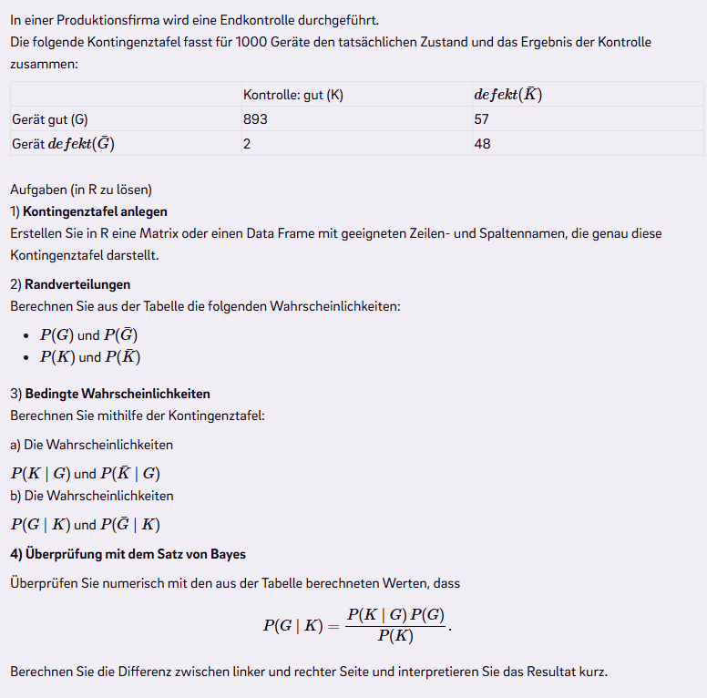

# 1) Tabelle erstellen

```{r}
tab <- matrix(
  c(893, 57, 2, 48),
  nrow = 2,
  byrow = TRUE,
  dimnames = list(
    Zustand = c("G", "G_bar"),
    Kontrolle = c("K", "K_bar")
  )
)

tab
```

# 2) Randverteilung berechnen
```{r}
P_G <- (893 + 57) / 1000
P_G_bar <- 1 - P_G
P_K <- (893 + 2) / 1000
P_K_bar <- 1 - P_K

P_G
P_G_bar
P_K
P_K_bar
```

# 3) Bedingte Wahrscheinlichkeit

$P(K|G) = 893 / (893 + 57)$

```{r}
P_K_given_G <- 893 / (893 + 57)
P_K_given_G
```

$P(\bar{K}|G) = 57 / (893 + 57)$

```{r}
P_K_bar_given_G <- 57 / (893 + 57)
P_K_bar_given_G
```

$P(G|K) = 893 / (893 + 2)$

```{r}
P_G_given_K <- 893 / (893 + 2)
P_G_given_K
```

$P(\bar{G}|K) = 2 / (893 + 2)$

```{r}
P_G_bar_given_K <- 2 / (893 + 2)
P_G_bar_given_K
```

# 4) Überprüfung mit dem Satz von Bayes
```{r}
P_G_given_K_bayes <- (P_K_given_G * P_G) / P_K
P_G_given_K_bayes
```

Differenz zwischen Version Bayes und nicht-Bayes:

```{r}
diff <- P_G_given_K - P_G_given_K_bayes
diff
```

Die Differenz entsteht durch Rundungsfehler bei Gleitkommazahlen in R. Denn R speichert Zahlen wie 0.94, 0.95 oder 0.895 nicht exakt ab. Intern sind es Biärdarstellungen und haben kleine Ungenauigkeiten. Bei mehreren Operationen summieren sich diese Ungenauigkeiten minimal. 

