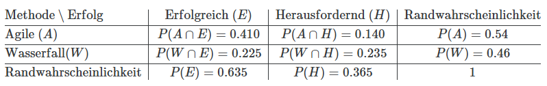
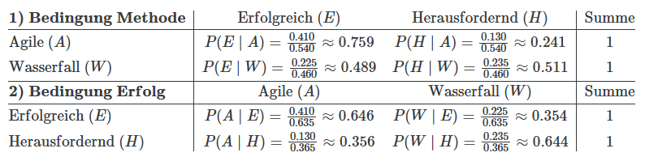

# Tutorial Schrit für Schritt durcharbeiten

## Aufgabe 1: Setup in R und Import der Daten

```{r}
#| message: false
#| warning: false
#| 
library(tidyverse)

data_projekte <- read_csv("data/software_projektdaten.csv", show_col_types = FALSE)

# Faktoren definieren für korrekte Sortierung
data_projekte <- data_projekte %>%
  mutate(
    Methode = factor(Methode, levels = c("Agile", "Wasserfall")),
    Erfolg = factor(Erfolg, levels = c("Erfolgreich", "Herausfordernd"))
  )

glimpse(data_projekte)

# Die ersten paar Einträge der Daten ausgeben
head(data_projekte)
```

## Erstellen der Kontingenztabellen

Um die Kontingenztabelle zu erstellen, müssen wir zählen, wie häufig die mögichen Paarungen auftreten können in einem Projekt, das heisst (Agile/Erfolgreich), (Agile/Herausfordernd), (Wasserfall/Erfolgreich), (Wasserfall/Herausfordernd). Für die sogenannten Randsummen zählen wir wie häufig die einzelnen Kategorien Agile, Wasserfall, Erfolgreich und Herausfordernd auftreten. 

Das schauen wir sowohl in Base R als auch in tidyverse an. 

### Vorgehen mit Base-R

```{r}
# Einfache Kreuztabelle
abs_table_base <- table(data_projekte$Methode, data_projekte$Erfolg)
abs_table_base

# Randsummen hinzufügen
addmargins(abs_table_base)
```

### Vorgehen in Tidyverse

Im Tidyverse zählen wir zuerst mit count() für beide Variablen, wie häufig die Kategorien vorkommen. Mit pivot_wider() gehen wir dann vom long zum wide Format (vergleich das Tutorial von Prof. Mike Chapple zum Data Wrangling mit R). Die Randsummen hinzuzufügen ist etwas aufwendiger als mit Base-R, wie wir gleich sehen.

```{r}
tabelle_breit <- data_projekte |> 
  count(Methode, Erfolg) |> 
  pivot_wider(names_from = Erfolg, values_from = n)

# Zeilensumme hinzufügen (Randverteilung von X)
tabelle_breit <- tabelle_breit |> 
  mutate(Summe_Erfolg = rowSums(across(where(is.numeric))))

# Spaltensumme hinzufügen (Randverteilung von Y)
tabelle_komplett <- tabelle_breit |> 
  bind_rows(
    tabelle_breit |> 
      summarise(across(where(is.numeric), sum)) |> 
      mutate(Methode = "Summe Methode")
  )

tabelle_komplett
```

Damit haben wir nun die gleiche Kontingenztabelle wie mit Base-R. Der Vorteil liegt jedoch darin, dass wir mit dieser in der Variablen tabelle_komplett bei der späteren Visualisierung viel besser arbeiten können.

# Aufgabe 2.1: Relative Häufigkeiten (Gesamtanteil)

Die Frage nach den relativen Häufigkeiten ist die Frage nach dem Anteil jeder Kombination am Gesamten.

Relative Häufigkeiten (vgl. Mittag 9.1):
$$f_{ij}:= f(a_i,b_j) = \frac{h(a_i,b_j)}{n} = \frac{h_{ij}}{n} \to i = 1, 2, ..., k; j = 1, 2, ..., m$$

Mit Base-R berechnen wir:

```{r}
tab_rel <- addmargins(prop.table(abs_table_base))
tab_rel
```

- Innen: $(f_{ij} = h_{ij}/n)$ (gemeinsame relative Häufigkeit)
- Rechts/Unten: $(f_i)$ und $(f_j)$ (relative Randhäufigkeiten)
- Unten rechts: (1.00)

> Merke: Wenn ich Wahrscheinlichkeiten (relative Häufigkeiten) mit **korrekten Rändern** will, zuerst prop.table() und erst danach addmargins().

Version mit Tidyverse:

```{r}
tabelle_rel <- tabelle_breit |> 
  mutate(across(where(is.numeric), ~ .x / 200))

tabelle_rel
```

# Aufgabe 3: Gemeinsame und bedingte Wahrscheinlichkeiten

Jetzt überlegen wir uns, wie wir z.B. $P(Erfolg \cap Methode)$ oder $P(Erfolg|Methode)$ aus relativen Häufigkeiten berechnen können.

In diesem Block haben wir Wahrscheinlichkeiten und bedingte Wahrscheinlichkeiten kennengelernt. Nach der frequentistischen Vorstellung von Laplace können wir mit den relativen Häufigkeiten aus der Kontingenztabelle die zugehörigen Wahrscheinlichkeiten abschätzen. So können wir z.B. aus den Randsummen die Wahrscheinlichkeit schätzen, dass ein beliebig gezogenes Projekt Agile durchgeführt wurde:

$$P(Agile) \approx \frac{h_1}{n} = \frac{108}{200} \approx 0.54$$
Gleiches gilt für die inneren Zellen der Kontingenztabelle. Wir können z.B. $P(Erfolgreich \cap Agile)$ berechnen:

$$P(Erfolgreich \cap Agile) = \frac{h_{11}}{n} \approx \frac{82}{200} \approx 0.41$$

Für die ganze Kontingenztabelle der relativen Häufigkeiten bedeutet das:

Die Wahrscheinlichkeitstabelle (gemeinsame und Randwahrscheinlichkeiten (Joint & Marginal Probabilities))

Die relativen Häufigkeiten als Schätzung der gemeinsamen und marginalen oder Randwahrscheinlichkeiten, können wir die Kontingenztabelle uns nun so vorstellen:

- Zellen im Inneren(z.B. $P(A \cap B)$): Dies sind die gemeinsamen Wahrscheinlichkeiten. Sie geben an, wie wahrscheinlich es ist, dass ein Projekt beide Eigenschaften gleichzeitig besitzt.
- Randsummen: Dies sind die Randwahrscheinlichkeiten (marginal probabilities) z.B. $P(A). Sie entstehen durch Summation der Zeilen bzw. Spalten.
- Die 1 unten rechts: Sie repräsentiert das sichere Ereignis (100 %), da die Summe aller möglichen Merkmalskombinationen immer 1 ergeben muss.


Nun interessieren wir uns noch für die bedingten Wahrscheinlichkeiten, die wir mit Hilfe der Kontingenztabelle schätzen können. Z.B. die Wahrscheinlichkeit, dass ein Projekt, welches mit der agilen Methode durchgeführt wurde erfolgreich war $P(Erfolgreich|Agile)$. Dies berechnet sich nach Definition aus:

$$P(E|A) = \frac{P(E \cap A)}{P(A)} \approx \frac{82/200}{108/200} \approx 0.759$$

Alle bedingten Wahrscheinlichkeiten im Überblick:



Was lernen wir daraus? Wir interessieren uns in der Praxis dafür, wie sich die Auswahl der Methode auf den Erfolg hat. Hier sehen wir einen deutlichen Unterschied. Während agile Projekte eine geschätzte Erfolgswahrscheinlichkeit von ca. 76 % aufweisen, liegen Wasserfall-Projekte deutlich darunter (ca. 49 %). Der zweite Teil der Tabelle mit Bedingung Erfolg wäre die Frage, mit welcher geschätzten Wahrscheinlichkeit ein erfolgreiches Projekt Agil oder Wasserfall ist? Das ist meist weniger interessant.

# Zwischenfazit: Was lernen wir aus Kontingenztabellen?

- Kontingenztabellen sind das Standardwerkzeug, um Zusammenhänge zwischen kategorialen Variablen in der EDA sichtbar zu machen (z. B. Methode () Erfolg).
- Aus absoluten Häufigkeiten (h_{ij}) werden über relative Häufigkeiten (f_{ij}=h_{ij}/n) Schätzungen von gemeinsamen und Randwahrscheinlichkeiten.
- Mit bedingten Wahrscheinlichkeiten (z. B. (P(EA))) beantworten Sie die zentrale Praxisfrage: Wie verändert sich die Erfolgsquote unter einer bestimmten Bedingung?

# Visualisierung der Ergebnisse

Um die geschätzten Wahrscheinlichkeiten zu visualisieren, nutzen wir zwei Ansätze.

## Aufgabe 4.1: Der 100% gestapelte Barplot (Fokus: Bedingte Wahrscheinlichkeit)

Dieser Plot ist die direkte visuelle Entsprechung zu unseren Berechnungen der bedingten Wahrscheinlichketien. Indem wir die Balken auf 100 % skalieren, eliminieren wir den Effekt, dass wir mehr Agile als Waterfall-Projekte im Datensatz haben. Wir vergleichen rein die Erfolgsquote.

```{r}
ggplot(data_projekte, aes(x = Methode, fill = Erfolg)) +
  geom_bar(position = "fill") +
  scale_y_continuous(labels = scales::percent) +
  scale_fill_manual(values = c("Erfolgreich" = "skyblue", "Herausfordernd" = "#e74c3c")) +
  labs(
    title = "Bedingte Wahrscheinlichkeit: Erfolg gegeben Methode",
    subtitle = "Vergleich der Erfolgsquoten (P(E|A) vs. P(E|W))",
    x = "Projektmethodik",
    y = "Anteil in Prozent",
    fill = "Projektausgang"
  ) +
  theme_minimal()
```

Interpretation: Hier sehen wir deutlich, dass der hellblaue Bereich bei “Agile” ca. 76 % des Balkens ausmacht, während er bei “Wasserfall” nur knapp unter 50 % liegt. Wenn wir also eine Projektmethode wählen, dann haben wir bei der agilen Methode eine viel höhere Erfolgswahrscheinlichkeit als beim traditionellen Wasserfall. Wir visualisieren also die Erfolgswahrscheinlichkeit unter der Bedingung der gewählten Methode.

## Aufgabe 4.2: Der Mosaik-Plot (Fokus: Gemeinsame & Randwahrscheinlichkeiten, Bonus)

Der Mosaik-Plot ist die “Königsdisziplin”, da er die gesamte Kontingenztabelle abbildet.

- Die Breite der Balken zeigt die Randwahrscheinlichkeit (Man sieht, dass Agile breiter ist).
- Die Höhe der Segmente zeigt die zugehörige bedingte Wahrscheinlichkeit.
- Die Fläche eines Rechtecks entspricht der zugehörigen gemeinsamen Wahrscheinlichkeit .

```{r}
# Wir nutzen hier die Basis-Funktion mosaicplot(), da sie sehr stabil ist
mosaicplot(abs_table_base, 
           main = "Mosaik-Plot: Methode vs. Erfolg",
           xlab = "Methode", 
           ylab = "Erfolg",
           color = c("skyblue", "#e74c3c"),
           border = "white")
```

Hier sehen wir anhand der Breite der Teilbalken noch, dass es mehr Agile als Wasserfall-Projekte gegeben hat, diese also überrepräsentiert waren.

## Zusammenfassung der Visualisierung

**100% Barplot**

- Was lerne ich daraus?: Welche Methode ist "effizienter"?
- Mathematischer Bezug: Bedingte Wahrscheinlichkeit

**Mosaik-Plot**

- Was lerne ich daraus?: Wie verteilen sich alle 200 Projekte insgesamt?
- Mathematischer Bezug: Gemeinsame Wahrscheinlichkeit

> Tipp: Wenn die Gruppen (Agile vs. Wasserfall) sehr unterschiedlich groß wären (z. B. 190 zu 10), würde der Mosaik-Plot dies durch einen extrem schmalen Balken sofort entlarven, während der 100% Barplot dies “verstecken” würde. Deshalb ist es immer gut, beide Perspektiven zu kennen.


